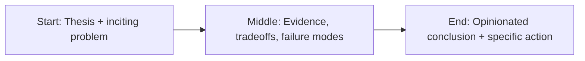

Most AI product strategy advice is fake.

Not _malicious_ fake—just detached from reality. It’s written by people optimizing for demos, conference talks, and “look what we built” screenshots, not by people carrying pager duty for production systems that can quietly burn money at 2am.


If you want AI to matter in a business, here’s the uncomfortable version of the playbook.

## 1) Start with the money move, not the model

Before anyone says “agents,” answer this: **what number moves if this works?**

- Revenue per rep
- Time-to-resolution
- Conversion rate
- Support handle time
- Churn

If no one can answer that in one sentence, you’re not doing product strategy. You’re doing curiosity-driven R&D with a budget.

## 2) Pick one workflow and make it undeniable

Teams keep trying to “AI-enable the platform.” That usually means 14 mediocre features and no measurable impact.

Pick one painful workflow where people already lose time and attention every day. Then make that one thing obviously better.

Not “interesting.”
Not “promising.”
**Better.**

## 3) Treat trust like a feature, because it is

A wrong answer with confidence is worse than no answer. So reliability has to be designed in from day one:

- traceable logs
- fallback paths
- clear uncertainty language
- human review where risk is high
- kill switches that actually work

If users can’t predict behavior, they stop using the system—or worse, they trust it when they shouldn’t.

## 4) Learn from production, not from meetings

Your real roadmap appears after launch. That’s where you find:

- where prompts fail
- where latency kills adoption
- where teams misuse the system
- where edge cases become the norm

Slides don’t teach this. Usage does.

## 5) Don’t ship “AI features.” Ship outcomes.

Nobody wakes up hoping to use an LLM. They want their work done faster, cleaner, with less cognitive drag.

So the bar is simple: if your AI layer disappeared tomorrow, would anyone be angry?

If the answer is no, you built theater.

If the answer is yes, you built product.

## Story map (start → middle → end)



## Concrete example

A practical pattern I use in real projects is to define a failure budget **before** launch and wire the fallback path in code, not policy docs.

```ts
type Decision = {
  confident: boolean;
  reason: string;
  sourceUrls: string[];
};

export function safeRespond(d: Decision) {
  if (!d.confident || d.sourceUrls.length === 0) {
    return {
      action: 'abstain',
      message: 'I don’t have enough reliable evidence. Escalating to human review.',
    };
  }
  return { action: 'answer', message: d.reason, citations: d.sourceUrls };
}
```

## Fact-check context: what changed in the last 18 months

The argument in this piece gets stronger when you look at current data instead of vibes. Stanford’s AI Index reports that organizational AI use jumped sharply year-over-year, with generative AI adoption in business functions accelerating from pilot novelty into default tooling. That scale jump matters because it explains why weak architecture now fails faster and louder: more users, more workflows, more exposure.

At the same time, developer sentiment is not blind optimism. Stack Overflow’s 2024 survey found strong adoption but materially lower trust in output correctness. That split—high use, lower trust—is the exact zone where leadership discipline matters most. Teams are using these systems anyway; the only question is whether the systems are instrumented, auditable, and failure-aware.

The takeaway is blunt: adoption is no longer the bottleneck. Reliability is.

## References

- https://www.anthropic.com/research
- https://platform.openai.com/docs/guides/evals
- https://aiindex.stanford.edu/report/
