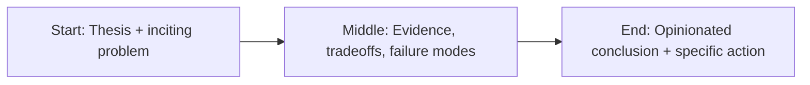

Everyone wants faster AI.


Very few teams invest equally in truthful AI.

That imbalance is why so many systems look good in demos and quietly fail in production.

If you don’t measure truth, you’re shipping fiction.

## Reliability starts with a hard definition of “correct”

Most teams define success as “the output sounded plausible.”

That is not a quality bar. That is storytelling.

You need task-specific correctness definitions:

- factual accuracy,
- policy compliance,
- citation validity,
- abstention behavior,
- consistency under prompt variation.

No definition, no reliability.

## Evals are infrastructure, not a one-time test

Evals should run like CI for language systems.

At minimum:

- benchmark sets per workflow,
- adversarial test cases,
- regression gates before release,
- score tracking across versions.

If your model or prompt changes without eval gates, your quality is drifting whether you notice or not.

## Design for “I don’t know”

A reliable system must be allowed to abstain.

This sounds obvious. It is rarely implemented well.

You need explicit thresholds and fallback behavior:

- when confidence is low,
- when retrieval quality is weak,
- when policy conflicts are detected.

Abstaining is not failure.

False confidence is failure.

## Truth needs provenance

Users trust answers they can verify.

That means traceability by default:

- source links,
- retrieval snippets,
- timestamped references,
- confidence notes where appropriate.

No provenance = no auditability.

No auditability = no enterprise trust.

## Monitoring in production is non-negotiable

Reliability is not solved at launch.

It is managed over time.

Track:

- hallucination rate (from sampled review),
- policy violations,
- user correction frequency,
- escalation rates,
- source freshness failures.

Then close the loop with weekly reliability reviews.

Not monthly. Weekly.

The system is changing in real time. Your governance should too.

## Separate velocity from recklessness

Teams fear that governance slows innovation.

Bad governance does.

Good governance accelerates trusted shipping because it reduces rollback chaos and stakeholder panic.

Reliable systems move faster over time because teams stop relearning the same painful lessons.

## A practical reliability stack

If you’re building in a regulated or high-stakes environment, your stack should include:

1. Input validation and policy filtering
2. Retrieval quality checks
3. Structured generation constraints
4. Post-generation verification
5. Human escalation workflows
6. Logging + audit trails
7. Evals + release gates

This is not overkill.

It is the minimum for trustworthy outcomes.

## Leadership behavior matters

Reliability culture is set at the top.

When leaders reward only speed, teams optimize for shortcuts.

When leaders reward truth under pressure, teams build durable systems.

The question is not “Can we ship this this week?”

The better question is:

> Can we defend this output in front of a customer, regulator, or board?

If the answer is no, keep building.

## Final word

AI doesn’t have to be perfect.

It has to be governable, inspectable, and dependable enough for the decisions it influences.

That doesn’t happen by accident.

It happens when reliability is designed into the system from day one.

If your team can’t explain why an output is correct, you don’t have intelligence at scale.

You have autocomplete with branding.


## Story map (start → middle → end)



## Concrete example

A practical pattern I use in real projects is to define a failure budget **before** launch and wire the fallback path in code, not policy docs.

```ts
type Decision = {
  confident: boolean;
  reason: string;
  sourceUrls: string[];
};

export function safeRespond(d: Decision) {
  if (!d.confident || d.sourceUrls.length === 0) {
    return {
      action: "abstain",
      message: "I don’t have enough reliable evidence. Escalating to human review."
    };
  }
  return { action: "answer", message: d.reason, citations: d.sourceUrls };
}
```

## References

- https://www.anthropic.com/research
- https://platform.openai.com/docs/guides/evals
- https://aiindex.stanford.edu/report/

