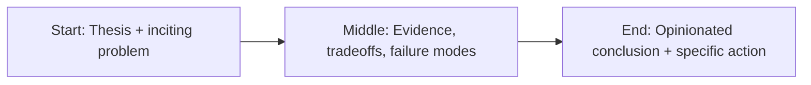

For decades, the operating system was supposed to fade into the background.


Stable. Predictable. Quiet.

Today, many enterprise teams experience the opposite: constant update anxiety, inconsistent UX behavior, and a growing stack of management overhead to maintain baseline reliability.

This isn’t nostalgia talking. It’s operational math.

## The hidden enterprise tax

When endpoint reliability drops, the cost does not appear in one line item.

It appears everywhere:

- helpdesk ticket volume,
- lost employee time,
- delayed patch rollouts,
- broken peripheral compatibility,
- increased policy complexity.

Each issue seems small. Together they form a sustained productivity leak.

## Bloat as product strategy

Modern platforms increasingly optimize for engagement, ecosystem lock-in, and upsell pathways.

That pushes in-product prompts, bundled experiences, and service coupling into the core OS surface.

The result: more moving parts in the one layer that should be boring by design.

Boring is a feature in enterprise infrastructure.

## Reliability drift is a leadership issue

This is not just a vendor problem. It’s also an enterprise governance problem.

Many orgs still manage endpoints as if OS behavior were static. It’s not.

Practical response:

1. Tighten update rings and blast-radius controls.
2. Expand pre-prod endpoint validation.
3. Track reliability KPIs as business metrics.
4. Separate “new feature” enthusiasm from production readiness.

If OS changes affect workflow continuity, platform management belongs in strategic planning—not just IT operations.

## Final take

The operating system should be a utility, not a drama generator.

When core platform behavior becomes unpredictable, companies lose focus on actual business outcomes.

The fix is twofold:

- vendors need to prioritize stability over optics,
- enterprises need to govern endpoints like mission-critical systems.

Anything less is paying a permanent tax for avoidable instability.


## Story map (start → middle → end)



## Concrete example

A practical pattern I use in real projects is to define a failure budget **before** launch and wire the fallback path in code, not policy docs.

```ts
type Decision = {
  confident: boolean;
  reason: string;
  sourceUrls: string[];
};

export function safeRespond(d: Decision) {
  if (!d.confident || d.sourceUrls.length === 0) {
    return {
      action: "abstain",
      message: "I don’t have enough reliable evidence. Escalating to human review."
    };
  }
  return { action: "answer", message: d.reason, citations: d.sourceUrls };
}
```

## References

- https://learn.microsoft.com/windows/release-health/
- https://www.cisa.gov/known-exploited-vulnerabilities-catalog
- https://sre.google/sre-book/table-of-contents/

