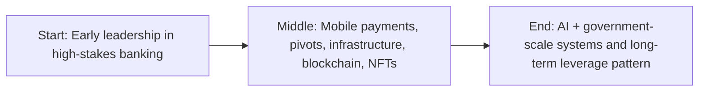

Most people optimize careers for stability.

Predictable promotions. Clean ladders. Manageable risk. A neat answer to “Where do you see yourself in five years?”

I’ve never been wired that way.

I’m drawn to systems that are unfinished, underdefined, and a little unstable. Systems that are about to matter, but haven’t yet. Systems where there is no playbook, no best practice, and no trusted blueprint.

From the outside, my career looks chaotic: banking, mobile payments, blockchain, NFTs, AI, government satellites.

From the inside, it’s one pattern: **pursue leverage at inflection points**.

## Start: becoming a director before I was ready

Early in my career, I landed at U.S. Bank and eventually became one of the youngest Directors of Engineering in company history.

That sounds impressive until you live it.

It means learning leadership while people’s paychecks depend on your decisions. It means architecting systems that move millions of dollars. It means owning outages, security incidents, audit findings, and executive pressure before you’ve fully figured out how internal politics even works.

Banking is brutal in quiet ways:

- downtime is unacceptable,
- latency is expensive,
- security is non-negotiable,
- compliance is constant.

That environment forces maturity fast.

But the most formative turn in my career did not happen in a boardroom.

It happened in a Starbucks.

## The Starbucks meeting that changed the trajectory

At Reston Town Center, I met the CEO of Electronic Transaction Systems (ETS). We talked about mobile in the early iPhone era—before “mobile-first” was every strategy deck’s favorite phrase.

He hired me.

ETS was a credit card processor focused on golf courses. Sounds niche. It was actually a smart operational niche: higher ticket sizes, lower event volatility, predictable behavior, cleaner scaling.

Inside that environment, we had enough room to experiment—and enough constraints to stay serious.

That’s where one of my most important product lessons happened.

## Middle: building Venmo-style flows before Venmo was mainstream

Before Venmo became a household habit, we built a mobile P2P product called **P-Money**.

The prompt from leadership was simple: _What if people could send money to each other from phones?_

So we built it.

It handled account linking, cards, wallet behavior, P2P transfer paths, onboarding, notifications, and settlement logic.

One behavior pattern we leaned into was “claim flow onboarding”: if someone sent money to a non-user, the recipient got a message and tapped to claim. Claim became signup. Signup became activation.

Today that sounds obvious. Back then, it wasn’t.

I was primarily focused on mobile while leaning hard on backend engineers and architects. Small company reality: no one hides in their lane. Everyone has production accountability.

### The hard part: security vs usability

Up to that point, a lot of payment systems assumed hardened terminals, controlled networks, and tightly managed device surfaces.

Opening mobile APIs to the wild internet changed everything.

Every security improvement added friction.
Every friction reduction scared security.

That tension is not a phase. It is fintech.

You either learn to operate inside it, or you build pretty demos that never survive real users.

## The pivot that broke momentum

P-Money got traction. Users understood it. The system worked.

Then leadership shifted focus toward “pay businesses.” From a top-line perspective, it was rational. From a product coherence perspective, it was destructive.

Most merchants sat on legacy POS infrastructure with weak integration surfaces. We tried external hardware, QR detours, and awkward bridge flows.

Merchants hated complexity.
Accountants hated reconciliation drift.
Users hated friction.

Marketing air-cover disappeared.
Momentum died.

About a year later, Venmo scaled the exact focus model many of us argued for: clean P2P first, no strategy sprawl, brutal product clarity.

That one still stings.

And it should.

If losses don’t teach you, they just repeat.

## Ten years in transaction infrastructure changed how I think

ETS was acquired by U.S. Bank. I stayed for roughly a decade.

I worked across fraud systems, transaction pipelines, APIs, reconciliation engines, analytics, reporting, and settlement layers.

This was pre-modern cloud convenience. We built hard systems with less abstraction and more direct accountability. Later, we migrated major surfaces to Azure and drove meaningful cost reductions while modernizing network and deployment models.

CI/CD by today’s standards was primitive. Tooling was often painful. But that period taught me the core lesson most glossy technical writing ignores:

**Systems fail at boundaries—between teams, between assumptions, between incomplete ownership models.**

If you know where the boundaries are, you can predict the breakpoints.

## Falling into blockchain (deliberately)

When blockchain became the next inflection zone, I went in hard.

It was messy, underregulated, and full of noise—which usually means both danger and opportunity.

Inside the bank, I led a research group with monthly exploration cycles, prototypes, and cross-functional participation. We learned a lot, but enterprise institutions often move slower than the technology cycle they are trying to interpret.

That mismatch creates frustration fast.

Then a friend called.

## The FaceTime moment and the $1,400 mistake

Friend says his boss is building something.
Boss is Gary Vaynerchuk.
One evening, I’m on FaceTime hearing NFT discussions with a room that included major celebrities.

He asked what I’d charge to build it.
I said **$1,400**.

Yes, really.

I wasn’t trying to be clever. I was naive and estimating based on a small-part-time build assumption. In hindsight, that quote is one of the funniest and most educational errors of my career.

I learned that underpricing isn’t humility. It’s bad systems thinking about value and scope.

## Launching VeeFriends and surviving celebrity-scale spikes

I built VeeFriends early infrastructure solo: smart contracts, website, minting path, and deployment stack.

Launch week moved roughly $22M.

What hit us was not steady-state load; it was event-driven traffic spikes tied to audience blasts. Banking prepared me for sustained throughput. Celebrity distribution creates instant flood behavior.

When big accounts posted, concurrency pressure exploded.

We rebuilt critical scaling behavior, including work with Microsoft architecture patterns, and hardened the platform over time.

For years, I led engineering, grew teams, shipped systems, and watched crypto go from mania to normalization.

That cycle reinforced another belief:

**Hype is not strategy. Enduring systems are strategy.**

## Discovering AI as systems leverage, not chatbot novelty

When ChatGPT wave hit mainstream, I didn’t see “chat.” I saw orchestration.

Agents, loops, workflows, decision support, and human-in-the-loop control surfaces.

At VeeFriends, we deployed agent-assisted pipelines across marketing, design, and content operations with humans retaining final control. It worked because we treated AI as a multiplier in systems, not a mascot feature.

This distinction still matters.

Teams that optimize for AI optics get temporary attention.
Teams that optimize for AI operating leverage get compounding outcomes.

## The hardest chapter: Hawkeye 360

Then came Hawkeye 360: AI leadership in a high-stakes environment involving RF and satellite-derived intelligence workflows and government-facing rigor.

I took a pay cut to join.

Now I’m effectively building AI strategy in an environment where “move fast and break things” is not just wrong—it’s disqualifying.

Everything must be:

- secure,
- auditable,
- explainable,
- defensible,
- operationally useful.

Traditional ML has clear precedent in these environments. LLM systems introduce different leverage and different risk surfaces. My mandate is straightforward:

**Create value. Prove it. Scale it. Under real constraints.**

## The pattern (and why it doesn’t feel chaotic to me)

Payments. Blockchain. NFTs. AI. Satellite/government contexts.

Not random.

These are all moments where value-transfer systems are being redefined.

That’s what I chase.

Not because it’s glamorous.
Because it’s difficult.
Because stakes are real.
Because if you understand a shift early, you can shape its operating model instead of inheriting everyone else’s mistakes.

## Where I am now

I’m still building.
Still uncomfortable.
Still wrong sometimes.
Still learning constantly.

I’ve undercharged.
Missed timing.
Lost bets.
Been dismissed.

I’ve also been early, repeatedly.

This is what career leverage looks like from the inside: less certainty, more accountability, and a willingness to stand in unfinished terrain long enough to turn it into something real.

I’m not done.

## Story map (start → middle → end)

## References

- https://www.usbank.com/
- https://www.venmo.com/
- https://www.microsoft.com/en-us/
- https://www.hawkeye360.com/
- https://www.veefriends.com/
