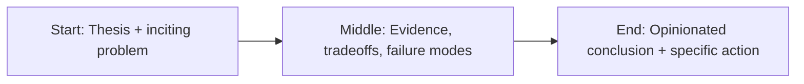

LAN parties looked like teenage chaos: tangled cables, overheating towers, and someone yelling because Counter-Strike dropped mid-round.

But under that chaos was one of the best engineering classrooms we ever accidentally built.


No one gave you a certificate. No one gave you a “module completion” badge. Your reward was simple: your setup either worked, or you sat there watching everyone else play.

## What LAN culture taught that bootcamps struggle to teach

### 1) Real debugging under social pressure

When your machine failed, you didn’t open Stack Overflow and disappear for two days. You had ten people waiting and one chance to fix it fast.

That builds a specific muscle: calm, iterative troubleshooting when stakes are immediate.

### 2) Systems thinking, not syntax memorization

You learned how hardware, drivers, switches, protocols, operating systems, and game servers interacted—because the failure modes were visible.

You stopped thinking in isolated files and started thinking in systems.

### 3) Peer-to-peer learning without ego theater

The best LAN rooms had one social rule: if you know something, help the next person.

Knowledge moved laterally, fast. That’s how strong engineering cultures work in real companies too.

### 4) Creativity under constraints

Old hardware, weird adapters, broken configs, no budget. You improvised.

That constraint-driven creativity is exactly what production engineering looks like once roadmaps meet reality.

## The credential trap

Bootcamps can be useful. They can accelerate entry and teach core tools quickly.

But many programs over-index on completion and under-index on operational judgment. You graduate knowing frameworks, but not always knowing how to reason through messy, interdependent failure.

And that’s the job.

## The takeaway

Great engineers are rarely produced by clean pipelines. They’re shaped by friction, curiosity, and repeated exposure to real problems with other humans in the loop.

LAN parties had all of that.

Modern engineering education should steal shamelessly from that playbook: less credential theater, more shared, messy, hands-on systems work.

## Story map (start → middle → end)



## Concrete example

A practical pattern I use in real projects is to define a failure budget **before** launch and wire the fallback path in code, not policy docs.

```ts
type Decision = {
  confident: boolean;
  reason: string;
  sourceUrls: string[];
};

export function safeRespond(d: Decision) {
  if (!d.confident || d.sourceUrls.length === 0) {
    return {
      action: 'abstain',
      message: 'I don’t have enough reliable evidence. Escalating to human review.',
    };
  }
  return { action: 'answer', message: d.reason, citations: d.sourceUrls };
}
```

## Fact-check context: leaders are behind their teams

Microsoft’s Work Trend data keeps showing the same pattern: employees are adopting AI tools faster than leadership operating models are catching up. In practice, that means shadow workflows, inconsistent quality bars, and policy drift hidden behind productivity gains.

GitHub Octoverse reinforces the velocity story: AI-related project activity and contributions continue to rise quickly, which means the technical surface area inside teams keeps expanding. More output is not the same as better outcomes.

So the management job has changed. The scarce skill is no longer “unlock output.” The scarce skill is building a system where output remains trustworthy under pressure.

## References

- https://www.microsoft.com/en-us/worklab/work-trend-index
- https://hbr.org/topic/leadership
- https://queue.acm.org/
