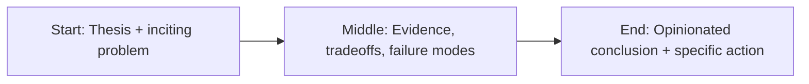

Everyone says AI teams should “move fast.”

Cool. Fast toward what?

Because I’ve seen teams move fast straight into rework, trust failures, and political blame games. Velocity alone is not a strategy. It’s just acceleration.


Leading AI teams well means holding two truths at once: experimentation is necessary, and standards are non-negotiable.

## 1) Make quality concrete, or accept chaos

If “good enough” is vague, every team defines it differently.

Set explicit quality bars:

- acceptable error rates
- latency budgets
- fallback behavior
- observability requirements
- review thresholds for high-risk outputs

Ambiguity feels flexible in the short term, then expensive in the long term.

## 2) Separate reversible and irreversible decisions

Most AI decisions are reversible: prompt design, retrieval settings, UI copy, model routing. Move quickly there.

Some are harder to unwind: compliance posture, customer-facing guarantees, architecture that locks in cost.

Great leaders don’t treat these the same. They protect decision quality where reversal is painful and speed where it’s cheap.

## 3) Force cross-functional language alignment

When product says “accuracy,” legal says “risk,” and engineering says “eval score,” you don’t have a team—you have adjacent departments.

Define shared terms early. Write them down. Use them in planning and postmortems.

It sounds boring. It saves quarters of confusion.

## 4) Reward learning velocity, not performative certainty

AI work punishes ego.

The teams that win are the ones that:

- run small tests
- admit what failed quickly
- update direction without drama
- protect people who surface inconvenient truth

If your culture rewards being right more than getting better, you’ll stall.

## 5) Leadership is mostly energy management

AI cycles can exhaust teams: constant model updates, shifting expectations, noisy hype.

Your job is to keep focus and reduce thrash:

- fewer priorities
- clearer ownership
- tighter feedback loops
- explicit “stop doing this” decisions

The best AI leaders I’ve seen are not the loudest or the most technical. They’re the ones who create clarity when everyone else is chasing novelty.

Fast is good.

Fast and coherent is rare.

That’s the bar.

## Story map (start → middle → end)



## Concrete example

A practical pattern I use in real projects is to define a failure budget **before** launch and wire the fallback path in code, not policy docs.

```ts
type Decision = {
  confident: boolean;
  reason: string;
  sourceUrls: string[];
};

export function safeRespond(d: Decision) {
  if (!d.confident || d.sourceUrls.length === 0) {
    return {
      action: 'abstain',
      message: 'I don’t have enough reliable evidence. Escalating to human review.',
    };
  }
  return { action: 'answer', message: d.reason, citations: d.sourceUrls };
}
```

## Fact-check context: leaders are behind their teams

Microsoft’s Work Trend data keeps showing the same pattern: employees are adopting AI tools faster than leadership operating models are catching up. In practice, that means shadow workflows, inconsistent quality bars, and policy drift hidden behind productivity gains.

GitHub Octoverse reinforces the velocity story: AI-related project activity and contributions continue to rise quickly, which means the technical surface area inside teams keeps expanding. More output is not the same as better outcomes.

So the management job has changed. The scarce skill is no longer “unlock output.” The scarce skill is building a system where output remains trustworthy under pressure.

## References

- https://www.microsoft.com/en-us/worklab/work-trend-index
- https://hbr.org/topic/leadership
- https://queue.acm.org/
