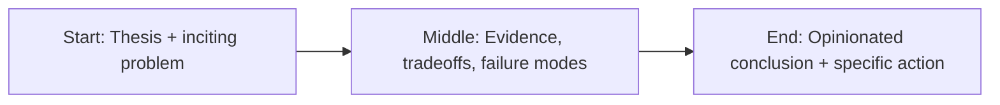

Most leadership advice for technical teams is already outdated.


The old model assumed stable tooling, predictable delivery cycles, and clear role boundaries.

AI erased that comfort.

Now tools change weekly, expectations scale monthly, and your best engineers are part builder, part product thinker, part systems analyst.

If you’re still managing with a 2012 playbook, you’re not leading modern teams.

You’re supervising a museum.

## What changed

Three shifts are reshaping engineering leadership.

### 1) Output got cheaper. Judgment got expensive.

AI can generate code, docs, tests, and drafts at ridiculous speed.

That means raw output is no longer your competitive edge.

Judgment is.

Your best people are the ones who ask better questions, define better constraints, and make better tradeoffs under ambiguity.

### 2) The architecture boundary moved up

Teams no longer just design software architecture.

They design decision architecture:

- what should be automated,
- what must be reviewed by humans,
- what failure modes are acceptable,
- what risk level maps to what control set.

Leadership now includes setting those boundaries clearly.

### 3) Learning velocity became a core KPI

In AI-heavy environments, static expertise expires quickly.

The winning teams are not the teams with the smartest individual.

They’re the teams that learn fastest together.

## The modern leadership stack

Here’s the operating model I recommend for directors and VPs running AI-saturated teams.

### Set a sharp quality bar

If quality is ambiguous, speed becomes chaos.

Make the bar explicit:

- what “good” means,
- what “unsafe” means,
- where humans must review,
- what metrics define success.

Teams don’t need more motivation.

They need clarity.

### Separate experiments from production

Many orgs blur prototyping and production.

That works until a prototype quietly becomes mission-critical.

Create a hard handoff model:

- discovery lane (fast, messy, cheap),
- production lane (governed, observable, resilient).

This preserves speed without sacrificing trust.

### Reward systems thinking, not heroics

Hero culture looks exciting and scales terribly.

Instead, reward:

- reusable components,
- documentation quality,
- incident prevention,
- team-level learning.

If your incentives reward firefighting, expect fires.

### Build cross-functional fluency

AI delivery breaks when product, legal, security, and engineering speak different languages.

Great leaders force alignment through shared vocabulary and shared rituals:

- risk reviews,
- architecture reviews,
- launch checklists,
- postmortems.

Communication is not soft work.

It is core infrastructure.

## The talent model is changing too

“Prompt engineer” as a standalone identity is fading.

The durable roles are hybrid:

- product-minded engineers,
- reliability-minded ML practitioners,
- domain experts who can reason with AI systems.

Prompt engineers were the webmasters of 2024.

Useful at a moment in time.

Not the final org chart.

## A leadership scorecard that actually matters

If you want a serious view of team health, track:

1. Production reliability of AI-assisted workflows
2. Time from idea to validated value
3. Regression rate after model/tool changes
4. Cross-team handoff friction
5. Learning velocity (experiments turned into standards)

Notice what’s missing: vanity metrics.

Nobody gets promoted because the demo looked cool.

## Culture: keep ambition, remove delusion

You can run high standards without turning the workplace into a panic machine.

The trick is simple:

- be ambitious about outcomes,
- be realistic about uncertainty,
- be ruthless about clarity.

People can handle hard problems.

They burn out from unclear priorities and constant context switching.

That is a leadership bug, not a talent issue.

## Final word

Leading technical teams in the AI era is not about chasing tools.

It’s about building an organization that can repeatedly turn new capability into trusted outcomes.

That requires:

- precision in standards,
- discipline in systems,
- humility in decision-making,
- and speed with accountability.

The leaders who master that won’t just survive this shift.

They’ll define it.

## Story map (start → middle → end)



## Concrete example

A practical pattern I use in real projects is to define a failure budget **before** launch and wire the fallback path in code, not policy docs.

```ts
type Decision = {
  confident: boolean;
  reason: string;
  sourceUrls: string[];
};

export function safeRespond(d: Decision) {
  if (!d.confident || d.sourceUrls.length === 0) {
    return {
      action: 'abstain',
      message: 'I don’t have enough reliable evidence. Escalating to human review.',
    };
  }
  return { action: 'answer', message: d.reason, citations: d.sourceUrls };
}
```

## Fact-check context: leaders are behind their teams

Microsoft’s Work Trend data keeps showing the same pattern: employees are adopting AI tools faster than leadership operating models are catching up. In practice, that means shadow workflows, inconsistent quality bars, and policy drift hidden behind productivity gains.

GitHub Octoverse reinforces the velocity story: AI-related project activity and contributions continue to rise quickly, which means the technical surface area inside teams keeps expanding. More output is not the same as better outcomes.

So the management job has changed. The scarce skill is no longer “unlock output.” The scarce skill is building a system where output remains trustworthy under pressure.

## References

- https://www.microsoft.com/en-us/worklab/work-trend-index
- https://hbr.org/topic/leadership
- https://queue.acm.org/
