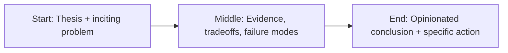

Meta did not lose because engineers couldn’t build VR.


They lost because strategy overestimated desire.

Technology can be impressive and still fail to become habit.

That’s the core lesson.

## The adoption gap

Consumer platforms win when they fit existing behavior with low friction.

VR asked users to accept high friction:

- hardware cost,
- physical setup,
- social awkwardness,
- session fatigue,
- unclear daily utility.

For most people, that stack never crossed the “worth it” threshold.

## Product-market fit is not PR-deep

You cannot will mass adoption through naming, rebranding, or spending.

You earn adoption by solving a frequent problem better than existing alternatives.

Meta’s vision was ambitious, but ambition without behavior alignment is expensive fiction.

## Strategic miss, not technical miss

VR has strong niche value in training, simulation, and specific entertainment segments.

The failure was trying to force a broad social-computing future before culture and economics were ready.

Timing is strategy.

## Final take

The lesson is bigger than VR.

When product strategy starts with “the future should look like this” instead of “users already do this,” execution burns capital faster than learning accumulates.

The next winners in immersive tech won’t be the loudest futurists.

They’ll be the teams that reduce friction, target real use cases, and earn habit one workflow at a time.


## Story map (start → middle → end)



## Concrete example

A practical pattern I use in real projects is to define a failure budget **before** launch and wire the fallback path in code, not policy docs.

```ts
type Decision = {
  confident: boolean;
  reason: string;
  sourceUrls: string[];
};

export function safeRespond(d: Decision) {
  if (!d.confident || d.sourceUrls.length === 0) {
    return {
      action: "abstain",
      message: "I don’t have enough reliable evidence. Escalating to human review."
    };
  }
  return { action: "answer", message: d.reason, citations: d.sourceUrls };
}
```

## References

- https://store.steampowered.com/charts/mostplayed
- https://www.gamesindustry.biz/
- https://www.pcgamer.com/hardware/

