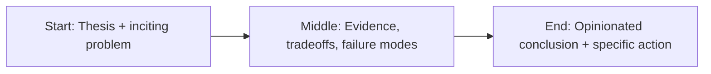

“Safe AI” is one of the most overused phrases in tech.


It sounds responsible. It photographs well on conference stages. It reassures boards.

And too often, it hides a hard truth: many safety claims are communication strategies, not system guarantees.

## Safety theater is easy to manufacture

You can build the appearance of safety with:

- glossy principles,
- ethics pages,
- selective benchmarks,
- impressive advisory boards.

None of that proves operational safety in production contexts.

Real safety requires repeatable controls, explicit failure boundaries, auditable logs, and accountability when systems fail.

Most organizations are not there.

## Why this gap exists

Safety has become a competitive narrative.

When labs race on capability and distribution, safety language becomes part of brand differentiation. That creates incentives to announce safety maturity before the engineering maturity exists.

This does not mean everyone is acting in bad faith.

It means incentives are misaligned.

And misaligned incentives produce risk.

## What “real safety” looks like

Safety is not a slogan. It is a stack.

At minimum:

1. Risk-tiered use-case classification
2. Evaluation suites aligned to those risk tiers
3. Runtime policy enforcement
4. Monitoring with incident response playbooks
5. Independent review of high-impact deployments
6. Clear legal and operational accountability

If an organization cannot show this with evidence, “safe AI” is marketing copy.

## The trust problem

Society is being asked to trust institutions that are simultaneously:

- shipping frontier systems,
- setting their own guardrails,
- and grading their own homework.

That model is unstable.

Healthy trust comes from adversarial verification, not self-attestation.

## Governance needs engineering teeth

Policy discussions are necessary, but policy without implementation detail is governance fan fiction.

Boards and regulators should ask implementation-level questions:

- What are your model release gates?
- What failure classes trigger rollback?
- How do you detect policy drift over time?
- Which controls are tested continuously vs annually?

If answers are vague, risk is high.

## Final take

“AI safety” can be real.

But only when it behaves like an engineering discipline: measurable, testable, and accountable.

Until then, skepticism is not cynicism.

It is operational maturity.


## Story map (start → middle → end)



## Concrete example

A practical pattern I use in real projects is to define a failure budget **before** launch and wire the fallback path in code, not policy docs.

```ts
type Decision = {
  confident: boolean;
  reason: string;
  sourceUrls: string[];
};

export function safeRespond(d: Decision) {
  if (!d.confident || d.sourceUrls.length === 0) {
    return {
      action: "abstain",
      message: "I don’t have enough reliable evidence. Escalating to human review."
    };
  }
  return { action: "answer", message: d.reason, citations: d.sourceUrls };
}
```

## Fact-check context: regulation is no longer “later”

This is not a speculative compliance scenario anymore. The EU AI Act’s phased timeline has active obligations already in motion, with major high-risk requirements applying in the 2026 window. Whether a team is in the EU or not, those controls are becoming de facto market expectations for enterprise procurement and legal review.

NIST’s AI RMF remains the most practical framing because it translates policy talk into operating behaviors: Govern, Map, Measure, Manage. That sequence maps directly to real release gates and post-market monitoring, which is where most organizations are still weak.

If you still think governance can be postponed until after growth, you are betting your roadmap on legal latency. That’s a bad bet.

## References

- https://www.anthropic.com/research
- https://platform.openai.com/docs/guides/evals
- https://aiindex.stanford.edu/report/

