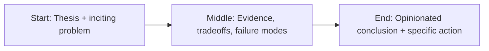

RAG is having its spreadsheet moment.


Everybody has it. Everybody says it’s critical. Almost nobody is using it well.

Let’s be blunt: most enterprise chatbots are dead on arrival because teams confuse an architecture pattern with a product strategy.

RAG is a component. Not a company plan.

## The fantasy

The fantasy goes like this:

1. Index documents.
2. Add retrieval.
3. Wrap a UI around it.
4. Declare internal knowledge solved.

Then reality shows up:

- stale docs,
- missing access controls,
- vague answers with fake confidence,
- “I don’t trust this thing” from power users.

Adoption collapses. Leadership blames the model.

Wrong diagnosis.

The issue is system design.

## RAG fails when retrieval quality is treated as optional

RAG systems are only as good as their retrieval layer.

If retrieval is noisy, generation is noise with punctuation.

Common failure patterns:

- chunking that destroys context,
- embeddings chosen without domain evaluation,
- no metadata strategy,
- poor ranking,
- no citation checks,
- no freshness controls.

You can’t prompt your way out of retrieval debt.

## The real stack you need

If you want RAG to survive production, you need a full stack mindset.

### Ingestion discipline

- dedupe aggressively,
- normalize formats,
- preserve source metadata,
- track provenance.

If your source graph is chaos, your answers will be professionally formatted chaos.

### Retrieval observability

You need to see:

- which chunks were retrieved,
- why they were ranked,
- whether they were actually relevant,
- where the pipeline failed.

No observability, no trust.

If your RAG system doesn’t have observability, it’s a toy.

### Access and policy boundaries

Enterprise knowledge is permissioned knowledge.

Your bot must respect identity, role boundaries, and policy constraints at query time—not in a hope-and-pray post-filter.

### Failure-aware response design

Good systems can say:

- “I don’t know,”
- “I need more context,”
- “Here are source links with confidence.”

Bad systems bluff.

Bluffing is a trust extinction event.

## What teams should optimize for instead

Don’t optimize for “chatbot wow moments.”

Optimize for **decision throughput**:

- time to find authoritative info,
- reduction in repetitive analyst work,
- lower escalation volume,
- faster onboarding.

That’s where business value lives.

## Product reality: users don’t want a chatbot

Most users don’t wake up wanting “AI.”

They want:

- the right answer,
- fast,
- with proof,
- without risk.

RAG should usually be invisible inside workflows, not a standalone novelty interface.

Great enterprise AI feels like better software, not a science fair project.

## A practical launch rubric

Before shipping RAG into production, check these boxes:

1. Retrieval evaluation set exists and is versioned.
2. Source freshness SLAs are defined.
3. Permission model is enforced end-to-end.
4. Output includes source traceability.
5. Hallucination and abstention behavior is tested.
6. Human escalation path is explicit.
7. Metrics tie back to a business outcome.

Miss three of these and you’re not launching a product.

You’re launching a demo with consequences.

## Final word

RAG is useful. I use it. I recommend it.

But let’s stop pretending it is the strategy.

Strategy is choosing where intelligence creates leverage.

Architecture is making that leverage reliable.

If you nail both, your AI product scales.

If you nail one, you’re just doing expensive improvisation.

## Story map (start → middle → end)



## Concrete example

A practical pattern I use in real projects is to define a failure budget **before** launch and wire the fallback path in code, not policy docs.

```ts
type Decision = {
  confident: boolean;
  reason: string;
  sourceUrls: string[];
};

export function safeRespond(d: Decision) {
  if (!d.confident || d.sourceUrls.length === 0) {
    return {
      action: 'abstain',
      message: 'I don’t have enough reliable evidence. Escalating to human review.',
    };
  }
  return { action: 'answer', message: d.reason, citations: d.sourceUrls };
}
```

## Fact-check context: what changed in the last 18 months

The argument in this piece gets stronger when you look at current data instead of vibes. Stanford’s AI Index reports that organizational AI use jumped sharply year-over-year, with generative AI adoption in business functions accelerating from pilot novelty into default tooling. That scale jump matters because it explains why weak architecture now fails faster and louder: more users, more workflows, more exposure.

At the same time, developer sentiment is not blind optimism. Stack Overflow’s 2024 survey found strong adoption but materially lower trust in output correctness. That split—high use, lower trust—is the exact zone where leadership discipline matters most. Teams are using these systems anyway; the only question is whether the systems are instrumented, auditable, and failure-aware.

The takeaway is blunt: adoption is no longer the bottleneck. Reliability is.

## References

- https://www.anthropic.com/research
- https://platform.openai.com/docs/guides/evals
- https://aiindex.stanford.edu/report/
