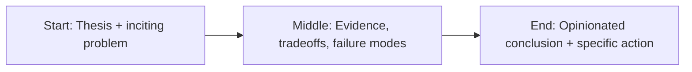

Most parents are still preparing kids for a labor market that is already disappearing.


That sounds harsh. It’s also increasingly true.

The old script—study hard, get stable role, climb predictable ladder—maps poorly to a world where automation continuously reshapes entry-level work.

## What kids actually need now

Beyond academics, kids need durable human advantages:

- communication,
- critical reasoning,
- adaptability,
- moral judgment,
- collaborative problem-solving.

These are hard to automate and essential for navigating uncertainty.

## Parenting as systems design

You cannot control the economy. You can design a home environment that builds resilience.

Practical moves:

1. Teach tool fluency without tool dependency.
2. Reward initiative over perfect answers.
3. Normalize learning in public and failing safely.
4. Build media and information discernment early.
5. Model values-driven decision making.

## Final take

The goal is not to predict every future job.

The goal is to raise humans who can create value across changing systems without losing character.

That requires intentional parenting now, not panic later.

## Story map (start → middle → end)



## Concrete example

A practical pattern I use in real projects is to define a failure budget **before** launch and wire the fallback path in code, not policy docs.

```ts
type Decision = {
  confident: boolean;
  reason: string;
  sourceUrls: string[];
};

export function safeRespond(d: Decision) {
  if (!d.confident || d.sourceUrls.length === 0) {
    return {
      action: 'abstain',
      message: 'I don’t have enough reliable evidence. Escalating to human review.',
    };
  }
  return { action: 'answer', message: d.reason, citations: d.sourceUrls };
}
```

## Fact-check context: kids are entering an AI-native information environment

AI exposure for children is no longer edge-case behavior. Guidance from child-safety and education organizations increasingly focuses on practical guardrails: literacy, transparency, safety controls, and development-aware design.

That matters because parenting decisions now sit upstream of labor-market adaptation. If children learn only tool usage without discernment, they will be high-output and low-judgment in exactly the moment judgment becomes the premium skill.

So the core parenting task is not raising kids who can “use AI.” It is raising kids who can think clearly while AI is everywhere.

## References

- https://www.commonsensemedia.org/artificial-intelligence
- https://www.unicef.org/globalinsight/reports/policy-guidance-ai-children
- https://www.oecd.org/en/topics/ai-jobs-and-skills.html
