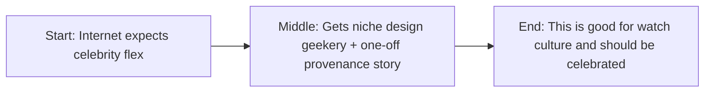

I love this story.

Not ironically. Not as meme content. Not as “look, celebrities are weird.”

Russell Crowe—yes, _that_ Russell Crowe—going full watch-nerd and breaking down Giuliano Mazzuoli pieces on camera is genuinely awesome. It’s specific, nerdy, unpolished enthusiasm. The internet needs more of that.

And the best part is he didn’t show up with the usual “look at my Rolex wall, I am rich” energy. He showed up talking about design language, motorsport references, pressure-gauge aesthetics, and weird crown mechanics. That’s collector brain. That’s hobby brain.

## Start: the internet expected flex, got geek

Most celebrity watch content follows a predictable script:

- mainstream hype pieces,
- obvious grails,
- value signaling,
- five-minute social clips engineered for applause.

What Crowe did feels different.

He went niche with Giuliano Mazzuoli, a brand that has always lived slightly off the main luxury rails. The Manometro line in particular has this industrial, instrument-panel DNA that rewards people who care about design logic—not just brand hierarchy.

Then he raised the bar with that commissioned never-released piece made from compressed sand from Saudi Arabia’s Empty Quarter.

That is absurd. That is extra. That is precisely why it rules.

## Why this is cool beyond celebrity novelty

Let’s say it plainly: watch culture is often too self-serious and too status-coded.

This moment breaks that pattern in a good way.

A-lister + microbrand + hyper-specific design appreciation is a signal that collecting can still be about curiosity and taste, not just secondary-market spreadsheets.

The guy is talking about rally-car-inspired dials and crown geometry like he’s been lurking in enthusiast forums for years. That authenticity is rare, especially in celebrity-adjacent content ecosystems where everything gets PR-filtered into blandness.

## The bombshell piece: compressed desert sand case

If the claim is accurate as described—a one-off commissioned piece, never commercially released, designer-level negotiation required—that is not a watch “drop.”

That’s artifact territory.

Collectors care about three things that compound value:

1. mechanical/design distinctiveness,
2. provenance,
3. story density.

This piece checks all three:

- unusual material origin (compressed sand from the Empty Quarter),
- bespoke commissioning context,
- high-visibility ownership by a globally recognizable actor.

Put those together and it becomes less a consumer object and more a cultural object.

## The part people get wrong about celebrity collecting

Common lazy take: “He’s rich, of course he has weird watches.”

That misses the point.

Being rich can buy inventory. It cannot buy taste development.

What stands out here is choice architecture. If you only wanted market-safe flex, you wouldn’t choose this lane. You’d choose auction-certified blue-chip names and call it a day.

Choosing something this specific says you actually care about the object itself.

That’s collector behavior, not image management.

## My auction take: what would it go for?

If this piece ever hit a serious sale with documented provenance and credible verification, I’d expect intense bidding from three buyer classes:

- celebrity provenance collectors,
- design-first independents crowd,
- narrative-driven high-net-worth buyers who value singularity.

My rough, unapologetically speculative range:

- **conservative:** low six figures,
- **heated room:** mid six figures,
- **peak narrative cycle:** maybe higher if two ego bidders collide.

Is that about intrinsic horology alone? No.

It’s about story power plus scarcity plus owner signal.

And that has always been part of watch auctions whether people want to admit it or not.

## Where I’m uncertain

Two honest unknowns:

1. How deep is this as a long-term collector identity vs a vivid current chapter?
2. How strong is the documentation on the one-off material/process story?

Both matter for ultimate market treatment.

Because in high-end collecting, provenance quality is everything. The difference between “cool anecdote” and “institution-grade lot note” is usually paperwork.

## Industry norm I’d love to retire

Can watch media stop pretending only one kind of collecting is legitimate?

The “approved path” usually sounds like this:

- buy safe references,
- discuss price trajectories,
- avoid weird taste,
- perform seriousness.

That mindset makes the culture smaller.

We should celebrate more off-center collecting behavior—especially when it’s rooted in real design appreciation.

Watch culture gets better when people bring personality into it.

## End: yes, this is awesome

Russell Crowe turning into a watch vlogger and flexing a desert-sand one-off is exactly the kind of weird, specific, joyful collecting energy that keeps this hobby alive.

It’s niche. It’s nerdy. It’s slightly unhinged in the best way.

And if you’re asking whether I think it’s cool?

Absolutely.

No notes.

## Story map (start → middle → end)

## References

- https://monochrome-watches.com/the-design-argument-why-giuliano-mazzuoli-still-stands-out-from-the-crowd/
- https://monochrome-watches.com/introducing-giuliano-mazzuoli-manometro-italia-price/
- https://brobible.com/culture/article/russell-crowe-showing-off-watch-collection/
- https://timetransformed.com/2018/04/04/russell-crowe-and-his-watches/
- https://www.sothebys.com/en/articles/the-power-of-provenance-how-celebrity-drives-the-luxury-market
