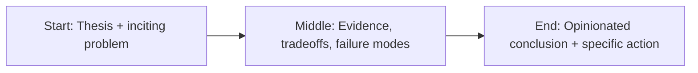

Let’s say the quiet part out loud: software employment is being re-tiered in real time.


Not because software demand vanished. It didn’t.

Because frontier-model economics changed what work is expensive, what work is cheap, and what work is now optional.

People frame this as “AI helps developers.” True, but incomplete. The larger effect is labor compression: fewer people required for the same output in specific bands of work—especially junior and lower-mid implementation tasks.

This shift is not accidental. It is the logical consequence of where major labs are investing: autonomous coding workflows, agent loops, and tools that move from assistance toward partial replacement.

## The new economics of software labor

Historically, software teams scaled by adding headcount. When demand grew, organizations hired more engineers and distributed tasks across levels.

Now, a senior engineer with strong AI workflow discipline can execute the output of multiple traditional roles in:

- boilerplate generation,
- refactoring assistance,
- test drafting,
- internal tooling scaffolds,
- documentation and migration work.

The immediate business result is obvious: CFOs see productivity gains without proportional hiring.

The second-order result is the real story: fewer entry ramps into the profession.

## Why junior roles feel the pressure first

Junior roles were historically justified by doing high-volume, lower-complexity implementation while learning architecture over time.

That exact category is where model tools are strongest.

When routine code production becomes cheap, companies ask a hard question: “Why hire three juniors when one senior + AI stack can deliver this quarter’s scope?”

That question is spreading from startups into enterprise orgs.

The labor market signal is already visible in hiring behavior: fewer pure-junior openings, higher expectations for “junior” postings, and stronger emphasis on domain context over raw coding speed.

## This is not “the end of engineers”

Let’s avoid lazy doom narratives.

Engineering is not dying. Engineering is stratifying.

Demand is rising for engineers who can:

- define system boundaries,
- evaluate model behavior,
- design reliable pipelines,
- implement governance and observability,
- align technical choices with business risk.

In other words: value is moving from syntax production to systems judgment.

## What leaders should do now

If you run engineering in 2026, pretending this is temporary is malpractice.

Practical moves:

1. Redesign career ladders around system ownership, not ticket velocity.
2. Build apprenticeship models that teach architecture + reliability early.
3. Measure productivity at workflow level, not lines-of-code theater.
4. Invest in AI governance as operating infrastructure.
5. Create new “AI systems engineer” pathways between app and platform teams.

If your talent model still assumes a 2019 pipeline, you are planning for a market that no longer exists.

## What engineers should do now

Career advice got simpler and harder at the same time.

Stop optimizing for being fast at what models do cheaply.

Start optimizing for what organizations still struggle to automate:

- framing ambiguous problems,
- making tradeoffs under uncertainty,
- integrating systems safely,
- explaining risk in business terms,
- shipping reliable outcomes.

The engineers who win won’t be the best prompt typists.

They’ll be the best decision architects.

## Final take

Big AI leaders are not “killing software jobs” as a cartoon villain story.

They are accelerating a market transition they openly believe is inevitable.

That transition will absolutely displace categories of work. And yes, millions of tasks across software orgs are being compressed.

The question is not whether this is happening.

The question is whether companies and engineers will adapt before the hiring structure hardens around a new baseline.

The safest strategy now is clarity:

- be honest about displacement,
- aggressive about reskilling,
- and disciplined about building teams around judgment, not just output.

That is how you survive the compression era.

## Story map (start → middle → end)



## Concrete example

A practical pattern I use in real projects is to define a failure budget **before** launch and wire the fallback path in code, not policy docs.

```ts
type Decision = {
  confident: boolean;
  reason: string;
  sourceUrls: string[];
};

export function safeRespond(d: Decision) {
  if (!d.confident || d.sourceUrls.length === 0) {
    return {
      action: 'abstain',
      message: 'I don’t have enough reliable evidence. Escalating to human review.',
    };
  }
  return { action: 'answer', message: d.reason, citations: d.sourceUrls };
}
```

## Fact-check context: labor signals are diverging

Public discourse keeps collapsing this topic into “AI replaces jobs” versus “AI creates jobs.” Real market behavior is messier. Developer survey and hiring data suggest rising tool adoption, changing skill expectations, and growing emphasis on judgment over rote implementation speed.

The key signal is not mass disappearance of software work. It is role redesign: fewer purely repetitive pathways, more demand for people who can own ambiguous systems outcomes.

That shift is uncomfortable for institutions built around old pipelines, but it is already underway whether career guidance has caught up or not.

## References

- https://www.bls.gov/ooh/computer-and-information-technology/software-developers.htm
- https://www.oecd.org/en/topics/ai-jobs-and-skills.html
- https://www.weforum.org/reports/the-future-of-jobs-report-2025/
