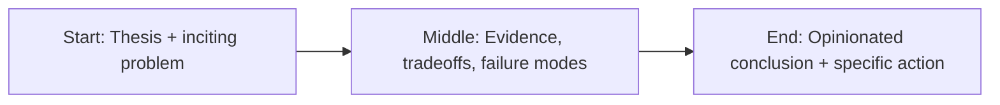

import Callout from '../../components/Callout.astro';
import SimpleBarChart from '../../components/SimpleBarChart.astro';

Most companies are treating AI compliance like a future problem.

That’s a mistake. The risk surface is already here: data handling, model provenance, export controls, retention, and explainability requirements are colliding with shipping velocity.

<Callout title="Executive Reality" tone="warning">
  If your AI roadmap does not include explicit compliance architecture, you do not have a roadmap.
  You have a liability timeline.
</Callout>

## Why this becomes painful fast

AI systems touch more governance domains than traditional apps.

You’re not only deploying software. You’re deploying decision influence.

That means auditors, legal teams, security teams, and regulators will evaluate:

- how data entered the system,
- what model generated outputs,
- what controls constrained behavior,
- what evidence proves responsible operation.

<SimpleBarChart
  title="Projected enterprise pressure by 2026"
  labels={['Ad-hoc AI', 'Governed AI', 'Regulated AI']}
  values={[30, 58, 82]}
/>

## What mature teams are doing now

1. **Inventory first:** map all AI-assisted workflows and classify risk.
2. **Control design:** apply policy filters, logging, and retention controls by risk tier.
3. **Evidence pipeline:** make audit evidence an automated byproduct, not a manual scramble.
4. **Governance cadence:** run monthly compliance reviews tied to release management.

<Callout title="Operator Rule" tone="insight">
  Governance is a product feature. It must be engineered, versioned, measured, and maintained just
  like reliability.
</Callout>

## Final take

The winners in enterprise AI won’t be the teams with the flashiest demos.

They’ll be the teams whose systems can stand up in front of legal, regulators, and the board—and keep shipping anyway.

## Story map (start → middle → end)



## Concrete example

A practical pattern I use in real projects is to define a failure budget **before** launch and wire the fallback path in code, not policy docs.

```ts
type Decision = {
  confident: boolean;
  reason: string;
  sourceUrls: string[];
};

export function safeRespond(d: Decision) {
  if (!d.confident || d.sourceUrls.length === 0) {
    return {
      action: 'abstain',
      message: 'I don’t have enough reliable evidence. Escalating to human review.',
    };
  }
  return { action: 'answer', message: d.reason, citations: d.sourceUrls };
}
```

## Fact-check context: regulation is no longer “later”

This is not a speculative compliance scenario anymore. The EU AI Act’s phased timeline has active obligations already in motion, with major high-risk requirements applying in the 2026 window. Whether a team is in the EU or not, those controls are becoming de facto market expectations for enterprise procurement and legal review.

NIST’s AI RMF remains the most practical framing because it translates policy talk into operating behaviors: Govern, Map, Measure, Manage. That sequence maps directly to real release gates and post-market monitoring, which is where most organizations are still weak.

If you still think governance can be postponed until after growth, you are betting your roadmap on legal latency. That’s a bad bet.

## References

- https://www.anthropic.com/research
- https://platform.openai.com/docs/guides/evals
- https://aiindex.stanford.edu/report/
